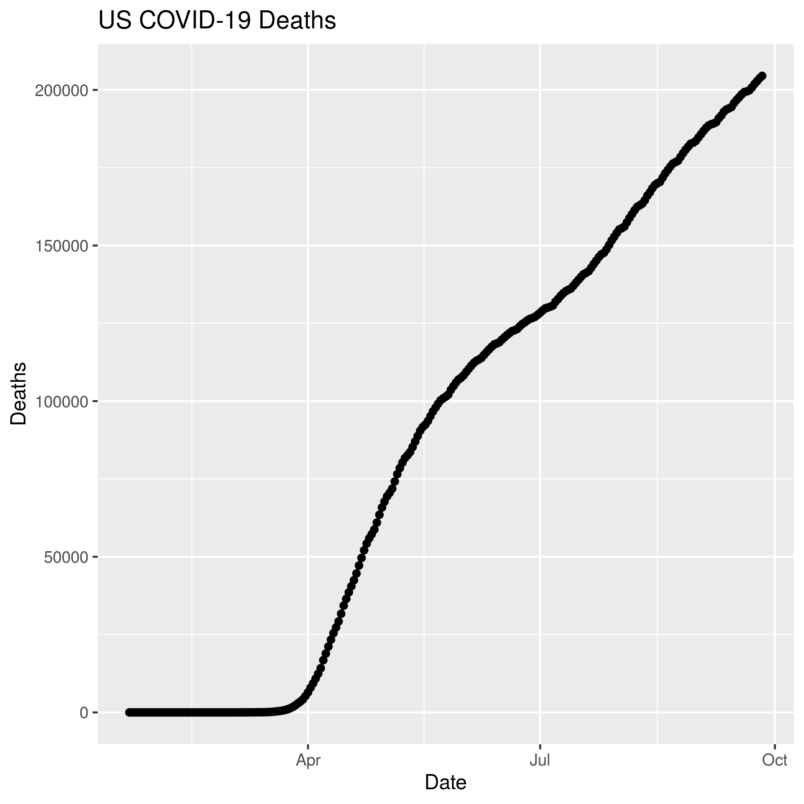

```{r setup, include=FALSE}
knitr::opts_chunk$set(echo = TRUE)
```

## Data for the Lab
```{r}
library(tidyverse)
library(lubridate)
options(max.print=1000)
```

```{r}
## Loading time series confirmed data
time_series_confirmed_long <- read_csv(url("https://raw.githubusercontent.com/CSSEGISandData/COVID-19/master/csse_covid_19_data/csse_covid_19_time_series/time_series_covid19_confirmed_global.csv")) %>%
  rename(Province_State = "Province/State", Country_Region = "Country/Region")  %>% 
  pivot_longer(-c(Province_State, Country_Region, Lat, Long), names_to = "Date", values_to = "Confirmed") 

## Loading time series deaths data
time_series_deaths_long <- read_csv(url("https://raw.githubusercontent.com/CSSEGISandData/COVID-19/master/csse_covid_19_data/csse_covid_19_time_series/time_series_covid19_deaths_global.csv")) %>%
  rename(Province_State = "Province/State", Country_Region = "Country/Region")  %>% 
  pivot_longer(-c(Province_State, Country_Region, Lat, Long), names_to = "Date", values_to = "Deaths")

## Creating Keys
time_series_confirmed_long <- time_series_confirmed_long %>% 
  unite(Key, Province_State, Country_Region, Date, sep = ".", remove = FALSE)
time_series_deaths_long <- time_series_deaths_long %>% 
  unite(Key, Province_State, Country_Region, Date, sep = ".") %>% 
  select(Key, Deaths)

## Join tables
time_series_long_joined <- full_join(time_series_confirmed_long,
    time_series_deaths_long, by = c("Key")) %>% 
    select(-Key)

## Reformat the Data
time_series_long_joined$Date <- mdy(time_series_long_joined$Date)

## Create report table with counts
time_series_long_joined_counts <- time_series_long_joined %>% 
  pivot_longer(-c(Province_State, Country_Region, Lat, Long, Date), names_to = "Report_Type", values_to = "Counts")
```

## Fine Tuning Goals

# Controlling Graph Size in RMarkdown
(r, eval=FALSE) the code will not be run, but will be shown

(r, code=FALSE) the code will not be shown, but will be run and output will shown, which is useful in reports where the reader is only interested in the results/graphs but not the code

## Graphic Output
```{r}
# Plot graph to a pdf outputfile
pdf("images/time_series_example_plot.pdf", width=6, height=3)
time_series_long_joined %>% 
  group_by(Country_Region,Date) %>% 
  summarise_at(c("Confirmed", "Deaths"), sum) %>% 
  filter (Country_Region == "US") %>% 
    ggplot(aes(x = Date,  y = Deaths)) + 
    geom_point() +
    geom_line() +
    ggtitle("US COVID-19 Deaths")
dev.off()

# Plot graph to a pnh outputfile
ppi <- 300
png("images/time_series_example_plot.png", width=6*ppi, height=6*ppi, res=ppi)
time_series_long_joined %>% 
  group_by(Country_Region,Date) %>% 
  summarise_at(c("Confirmed", "Deaths"), sum) %>% 
  filter (Country_Region == "US") %>% 
    ggplot(aes(x = Date,  y = Deaths)) + 
    geom_point() +
    geom_line() +
    ggtitle("US COVID-19 Deaths")
dev.off()
```

## RMarkdown loading images
# This is the RMarkdown style for inserting images
# Image must be in working directory
# This command is put outside the r code chunk



# This is an alternative way using html
# Remember that it must be in your working directory or you will need
# The tml is put outside the r code chunk


## Interactive graphs
# Version 2
```{r}
library(plotly)
ggplotly(
  time_series_long_joined %>% 
    group_by(Country_Region,Date) %>% 
    summarise_at(c("Confirmed", "Deaths"), sum) %>% 
    filter (Country_Region == "US") %>% 
    ggplot(aes(x = Date,  y = Deaths)) + 
      geom_point() +
      geom_line() +
      ggtitle("US COVID-19 Deaths")
 )
```
```{r}
library(plotly)
US_deaths <- time_series_long_joined %>% 
    group_by(Country_Region,Date) %>% 
    summarise_at(c("Confirmed", "Deaths"), sum) %>% 
    filter (Country_Region == "US")
 p <- ggplot(data = US_deaths, aes(x = Date,  y = Deaths)) + 
        geom_point() +
        geom_line() +
        ggtitle("US COVID-19 Deaths")
ggplotly(p)
```

## Animation Graphs
- transition_*()__ defines how the data should be spread out and how it relates to itself across time.
- view_*()__ defines how the positional scales should change along the animation.
- shadow_*()__ defines how data from other points in time should be presented in the given point in time.
- enter_()/exit_() defines how new data should appear and how old data should disappear during the course of the animation.
- ease_aes() defines how different aesthetics should be eased during transitions.

# Creating the Animations
```{r}
library(gganimate)
library(transformr)
theme_set(theme_bw())
```

```{r}
data_time <- time_series_long_joined %>% 
    group_by(Country_Region,Date) %>% 
    summarise_at(c("Confirmed", "Deaths"), sum) %>% 
    filter (Country_Region %in% c("China","Korea, South","Japan","Italy","US")) 
p <- ggplot(data_time, aes(x = Date,  y = Confirmed, color = Country_Region)) + 
      geom_point() +
      geom_line() +
      ggtitle("Confirmed COVID-19 Cases") +
      geom_point(aes(group = seq_along(Date))) +
      transition_reveal(Date) 
animate(p,renderer = gifski_renderer(), end_pause = 15)
```


