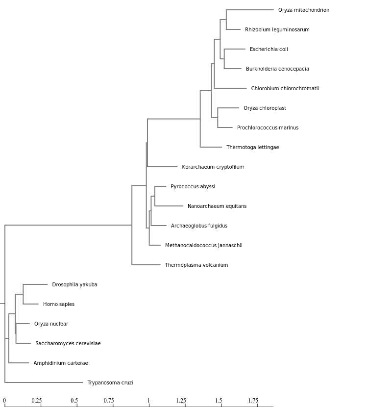

```{r setup, include=FALSE}
knitr::opts_chunk$set(echo = TRUE)
```

# Exercises for lab

# 1.


# 2.
```{r}
# worked through CIPRES and downloaded fastree_result.tre
```

# 3.
## ggtree tutorial 
```{r}
library(tidyverse)
if (!requireNamespace("BiocManager", quietly = TRUE))
  install.packages("BiocManager")
BiocManager::install("ggtree")
BiocManager::install("ggimage")
BiocManager::install("libmagick")
library(ggtree)
library(treeio)
library(ggimage)
```

# Basic Trees
```{r}
tree <- read.tree("data/tree_newick.nwk")
tree

ggplot(tree) + geom_tree() + theme_tree()
# or
ggtree(tree)
```
```{r}
# geom_treescale allows a scale bar
ggtree(tree) + geom_treescale()

# or

ggtree(tree) + theme_tree2()
```

```{r}
# producing a cladogram
ggtree(tree, branch.length = "none")
```

```{r}
# making cladogram without solid bars
ggtree(tree, branch.length="none", color="blue", size=2, linetype=3)
```
# Exercise 1.
```{r}
# 1. 
ggtree(tree, layout = "slanted")
# 2.
ggtree(tree, layout = "circular")
ggtree(tree, layout = "circular", branch.length = "none", color = "red", size = 2, linetype = 3)
```
# Other tree geoms
```{r}
# create the basic plot
p <- ggtree(tree)
# add node points
p + geom_nodepoint()
# add tip points
p + geom_tippoint()
# Label the tips
p + geom_tiplab()
```
# Exercise 2
```{r}
p + geom_nodepoint(color = "yellow") + geom_tiplab(color = "purple") + geom_tippoint(color = "purple") +
  ggtitle("Exercise 2 Figure")
```
 
# Tree Annotation
```{r}
# internal node number
ggtree(tree) + geom_text(aes(label=node), hjust=-.3)
```

```{r}
ggtree(tree) + geom_tiplab()
MRCA(tree, c("C", "E"))
MRCA(tree, c("G", "H"))
```

# Labeling clades
```{r}
ggtree(tree) + 
  geom_cladelabel(node=17, label="Some random clade", color="red")
```
```{r}
ggtree(tree) + 
  geom_tiplab() + 
  geom_cladelabel(node=17, label="Some random clade", 
                  color="red2", offset=.8)
```

```{r}
# labeling G and H
ggtree(tree) + 
  geom_tiplab() + 
  geom_cladelabel(node=17, label="Some random clade", 
                  color="red2", offset=.8) + 
  geom_cladelabel(node=21, label="A different clade", 
                  color="blue", offset=.8)
```

```{r}
# aligning the labels
ggtree(tree) + 
  geom_tiplab() + 
  geom_cladelabel(node=17, label="Some random clade", 
                  color="red2", offset=.8, align=TRUE) + 
  geom_cladelabel(node=21, label="A different clade", 
                  color="blue", offset=.8, align=TRUE) + 
  theme_tree2() + 
  xlim(0, 70) + 
  theme_tree()
```

```{r}
# highlighting regions where labels were added
ggtree(tree) + 
  geom_tiplab() + 
  geom_hilight(node=17, fill="gold") + 
  geom_hilight(node=21, fill="purple")
```

# Connecting taxa
```{r}
# curved lines can be added to show evolutionary events by connecting taxa
ggtree(tree) + 
  geom_tiplab() + 
  geom_taxalink("E", "H", color="blue3") +
  geom_taxalink("C", "G", color="orange2", curvature=-.9)
```
# Exercise 3.
```{r}
MRCA(tree, c("B", "C"))
MRCA(tree, c("L", "J"))

ggtree(tree) +
geom_tiplab() +
  geom_hilight(node = 19, fill = "purple") +
  geom_hilight(node = 23, fill = "yellow") +
  geom_cladelabel(node=17, label="Superclaude 17", 
                  color="red2", offset=.8, align=TRUE) + 
  geom_taxalink("C", "E", linetype = 2, color = "black", curvature = 0.7) +
geom_taxalink("G", "J", linetype = 2, color = "black", curvature = 0.5)
```

## Advanced Tree Annotation
```{r}

```
## Exercises

# 1.
```{r}
# Read the data
tree <- read.beast("data/flu_tree_beast.tree")
# Supply a most recent sampling date so you get the dates and add a scale bar
ggtree(tree, mrsd="2013-01-01") + 
  theme_tree2() 
# Finally, add tip labels and adjust axis
ggtree(tree, mrsd="2013-01-01") + 
  theme_tree2() + 
  geom_tiplab(align=TRUE, linesize=.5) + 
  xlim(1990, 2020)
```

```{r}
# aligning by changing coordination
msaplot(p=ggtree(tree), fasta="data/flu_aasequence.fasta", window=c(150, 175)) + coord_polar(theta="y")
```
# Bonus
```{r}
# many trees
set.seed(42)
trees <- lapply(rep(c(10, 25, 50, 100), 3), rtree)
class(trees) <- "multiPhylo"
ggtree(trees) + facet_wrap(~.id, scale="free", ncol=4) + ggtitle("Many trees. Such phylogenetics. Wow.")
```
```{r}
# plot tree with other data
# Generate a random tree with 30 tips
tree <- rtree(30)
# Make the original plot
p <- ggtree(tree)
# generate some random values for each tip label in the data
d1 <- data.frame(id=tree$tip.label, val=rnorm(30, sd=3))
# Make a second plot with the original, naming the new plot "dot", 
# using the data you just created, with a point geom.
p2 <- facet_plot(p, panel="dot", data=d1, geom=geom_point, aes(x=val), color='red3')
# Make some more data with another random value.
d2 <- data.frame(id=tree$tip.label, value = abs(rnorm(30, mean=100, sd=50)))
# Now add to that second plot, this time using the new d2 data above, 
# This time showing a bar segment, size 3, colored blue.
p3 <- facet_plot(p2, panel='bar', data=d2, geom=geom_segment, 
           aes(x=0, xend=value, y=y, yend=y), size=3, color='blue4') 
# Show all three plots with a scale
p3 + theme_tree2()
```

```{r}
# overlay organism silhouettes

newick <- "((Pongo_abelii,(Gorilla_gorilla_gorilla,(Pan_paniscus,Pan_troglodytes)Pan,Homo_sapiens)Homininae)Hominidae,Nomascus_leucogenys)Hominoidea;"

tree <- read.tree(text=newick)

d <- ggimage::phylopic_uid(tree$tip.label)
d$body_mass = c(52, 114, 47, 45, 58, 6)

p <- ggtree(tree) %<+% d + 
  geom_tiplab(aes(image=uid, colour=body_mass), geom="phylopic", offset=2.5) +
  geom_tiplab(aes(label=label), offset = .2) + xlim(NA, 7) +
  scale_color_viridis_c()
p  
```

# 4.
```{r}
FastTree <- read.tree("data/fasttree_results.tre")

FastTree
MRCA(FastTree, c("Oryza_mitochondrion", "Thermotoga_lettingae"))
MRCA(FastTree, c("Thermotoga_lettingae", "Trypanosoma_cruzi"))
MRCA(FastTree, c("Trypanosoma_cruzi", "Methanocaldococcus_jannaschii"))

ggtree(FastTree, layout = "circular", branch.length = "none", yscale = "none") + 
  xlim(0,40) +
  geom_tiplab(hjust = -0.1, size = 3) +
geom_hilight(node = 34, fill = "red", extend = 0.5) + 
  geom_hilight(node = 30, fill = "purple") +
geom_hilight(node = 25, fill = "brown") 
```
```